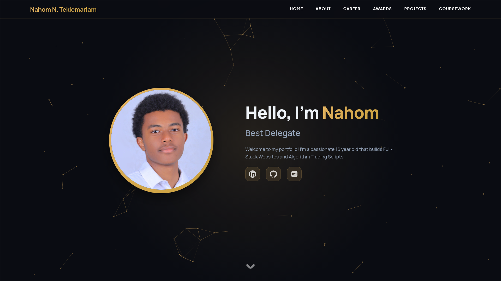

# Nahom Teklemariam – Portfolio Website

[](https://nahomtmariam.com)
[](https://reactjs.org/)
[](https://tailwindcss.com/)

 <!-- Replace with your actual screenshot -->

## 🚀 About Me

I'm **Nahom Teklemariam**, a front-end developer who loves building interactive, animated web experiences. This portfolio showcases my work from club websites and a newspaper platform to a custom file converter for my iPod.

## 🛠️ Tech Stack

- **React** – UI components & state management  
- **Tailwind CSS** – Utility-first styling  
- **JavaScript (ES6+)** – Logic & interactivity  
- **HTML5 & CSS3** – Semantic markup & custom animations  
- **3D Animations** – (Three.js / React Three Fiber & WebGL)

## ✨ Features

- Fully responsive design  
- Smooth 3D animations for immersive interaction  
- Project showcase with live links  
- Clean, modern UI built with Tailwind  
- Optimized for performance and accessibility

## 🧪 Local Development

To run this portfolio locally:

```bash
# Clone the repository
git clone https://github.com/shebaww/Portfolio.git

# Navigate to the project folder
cd Portfolio

# Install dependencies
npm install

# Start the development server
npm run dev
Then open http://localhost:5173 (or the port shown in your terminal).

📁 Featured Projects
1. Andinet Newspaper Website
🔗 andinet-newspaper.netlify.app
A digital newspaper platform built for a school club, featuring article layout, categories, and responsive design.

2. Business Club Website
🔗 shebaww.github.io/Business_Club_Website
Official site for a school business club – includes event info, team profiles, and contact section.

3. iPod File Converter
(Custom tool for iPod file conversion)
🔗 github.com/shebaww/Ipod-Converter
A utility I built to convert media files for compatibility with my iPod, demonstrates problem-solving and file-handling logic.

More projects available on the portfolio live site.

📬 Contact
Website: nahomtmariam.com

GitHub: github.com/shebaww (replace with yours)

Email: nahomnatnael87@gmail.com (replace with actual)

Built by Nahom Teklemariam
